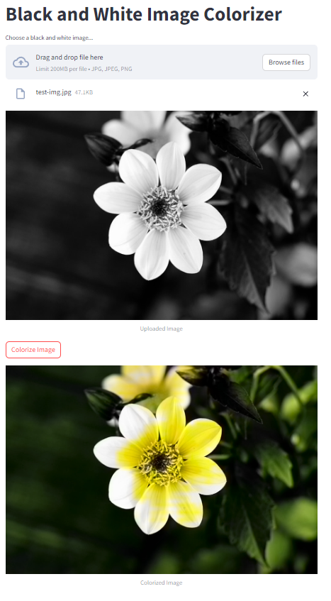

# Colorization

Colorization allows you to bring color back to black and white pictures.

This is a simple application written in Streamlit that uses a pre-trained model to colorize images, using the Colorization model.



## How to run the app

To run the app, you need to install the required libraries. You can do this by running:

```bash
pip install -r requirements.txt
```

Then, you can run the app with:

```bash
streamlit run app.py
```
